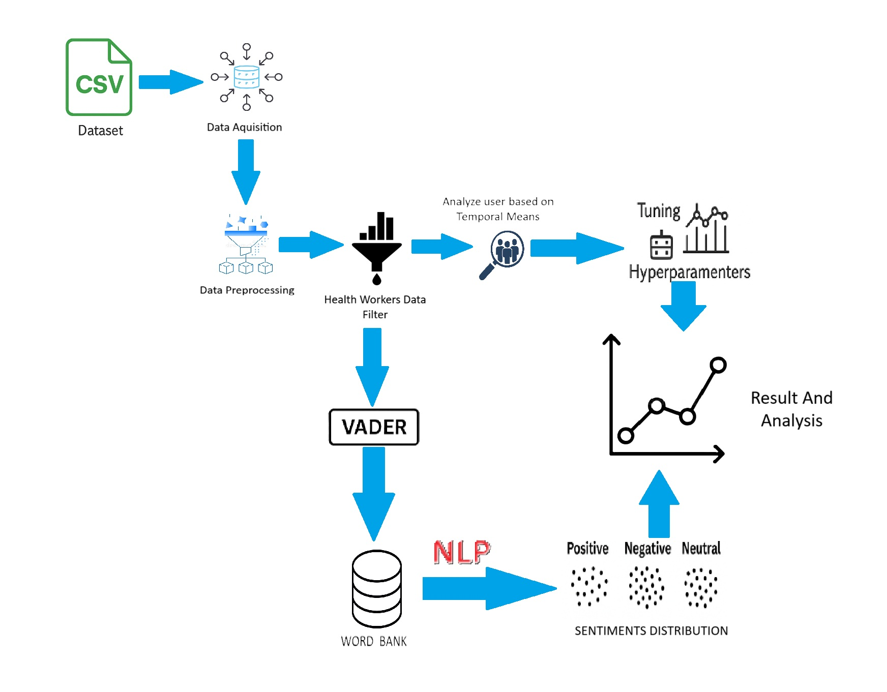
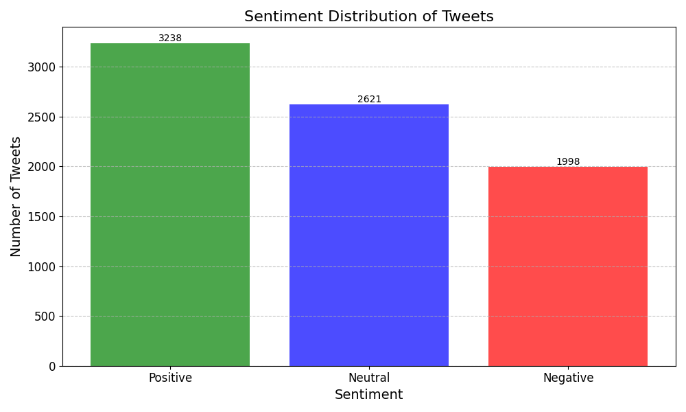
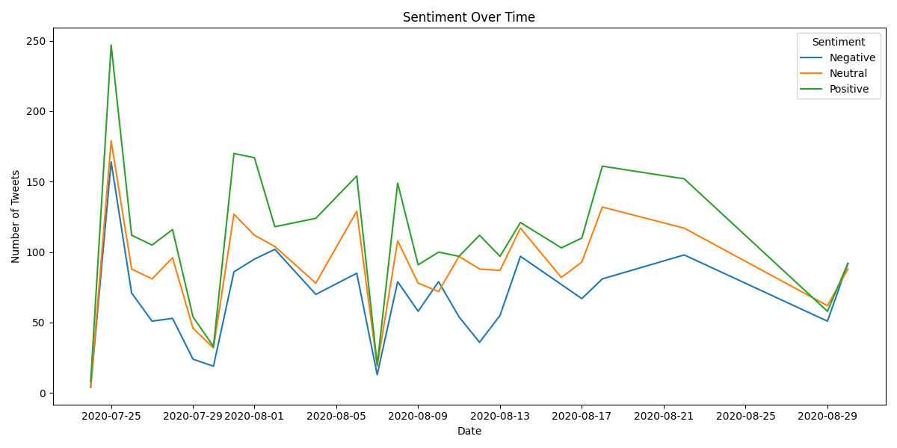
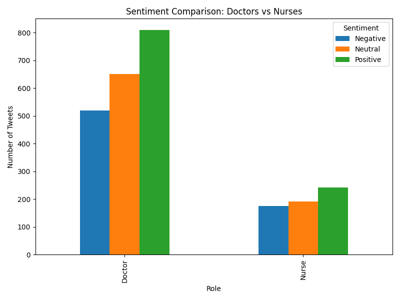
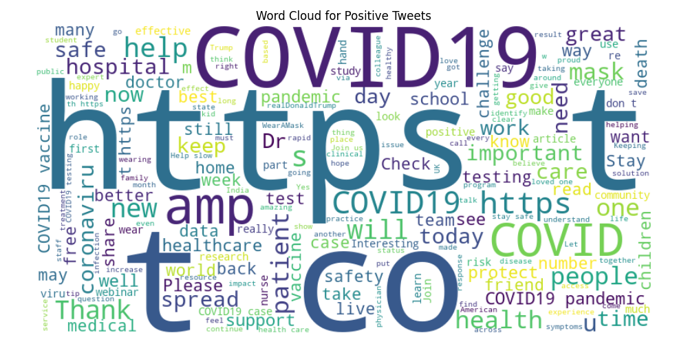
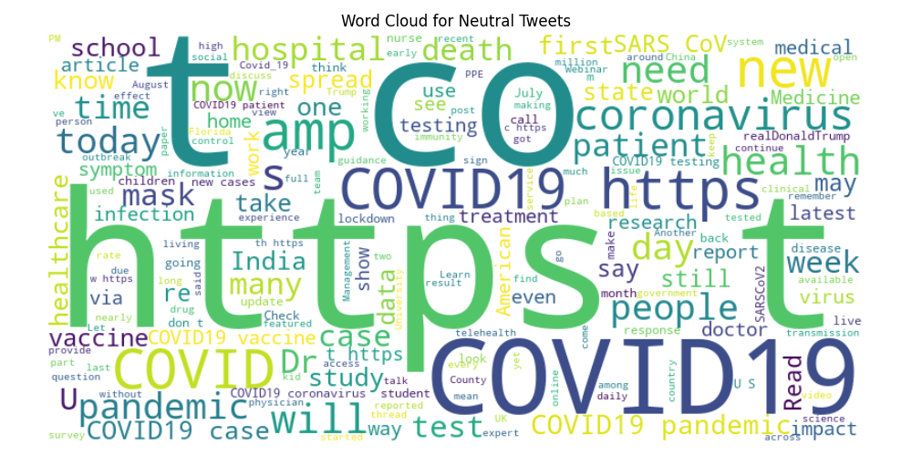
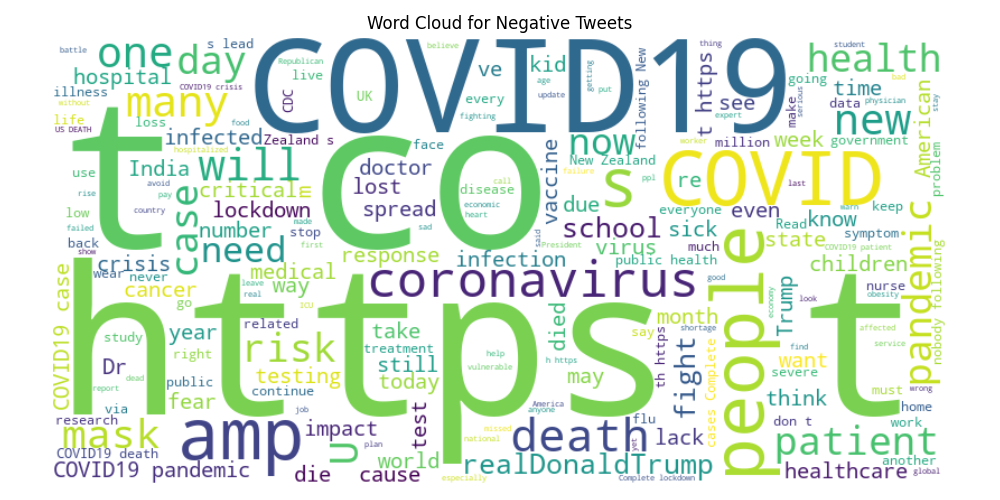

# Sentiment Analysis of Healthcare Workers During High-Stress Periods (COVID-19)

An end-to-end Natural Language Processing (NLP) and Data Analytics project analyzing public sentiment expressed by frontline healthcare workers on Twitter during peak COVID-19 pandemic periods.

---

## 📌 Project Overview

During global crises like the COVID-19 pandemic, healthcare workers face unprecedented physical and emotional strain. This project extracts, filters, and analyzes Twitter data to understand the prevailing sentiment, emotional trends over time, and focal topics among medical professionals (Doctors vs. Nurses).

### Key Objectives
* **Filtering Target Cohort:** Identify tweets originating specifically from healthcare professionals using user profile metadata.
* **Sentiment Classification:** Apply NLTK VADER sentiment intensity scoring to classify tweets into **Positive**, **Neutral**, and **Negative**.
* **Role-based & Temporal Analysis:** Evaluate sentiment shifts over time and compare emotional trends between Doctors and Nurses.
* **Topic Exploration:** Generate word clouds to highlight dominant themes across positive, neutral, and negative discourse.

---

## 📐 Project Architecture & Workflow



1. **Data Acquisition & Preprocessing:** Ingestion of Twitter dataset and normalization of text/columns.
2. **Healthcare Worker Filtering:** Keyword filtering (`doctor`, `nurse`, `physician`, `surgeon`, `medic`, `paramedic`, `healthcare`) against user bio descriptions.
3. **Sentiment Analysis:** Polarity scoring using NLTK's VADER Lexicon analyzer.
4. **Data Visualization:** Aggregation by timeline, role, and generating word cloud distributions.

---

## 📊 Key Findings & Visualizations

### 1. Overall Sentiment Distribution
Out of the filtered healthcare worker dataset, **Positive** sentiment was the most prominent (3,238 tweets), followed by **Neutral** (2,621 tweets) and **Negative** (1,998 tweets). High positive sentiment often reflected community support, successful treatment updates, and vaccine progress.



---

### 2. Temporal Sentiment Trends
Sentiment fluctuates dynamically alongside pandemic milestones, policy shifts, and surge peaks. 



---

### 3. Doctors vs. Nurses Sentiment Comparison
Comparing job roles reveals proportional similarities, though tweets attributed to doctors show a higher overall volume across all sentiment classes within this dataset.



---

### 4. Word Clouds by Sentiment

| Positive Sentiment | Neutral Sentiment | Negative Sentiment |
| :---: | :---: | :---: |
|  |  |  |

---

## 🛠️ Tech Stack & Dependencies

* **Language:** Python 3.x
* **Data Processing:** `pandas`
* **NLP & Sentiment Scoring:** `nltk` (VADER Lexicon)
* **Data Visualization:** `matplotlib`, `wordcloud`

---

## 📂 Project Structure

```text
Healthcare-Twitter-Sentiment/
│
├── images/                   # Visualizations & workflow diagrams
│   ├── flow.png
│   ├── bar.png
│   ├── spike.png
│   ├── dvn.png
│   ├── pos.png
│   ├── neu.png
│   └── neg.png
│
├── sentiment_analysis.py    # Primary pipeline (filtering, VADER analysis, temporal & role plotting)
├── plot_distribution.py     # Script for generating overall distribution bar charts
├── requirements.txt         # Required Python packages
├── .gitignore               # Excludes raw/cleaned CSV datasets from remote upload
└── README.md                # Project documentation

🚀 How to Run Locally
1. Clone the Repository
git clone [https://github.com/debeshisen/healthcare-covid-sentiment-analysis.git](https://github.com/debeshisen/healthcare-covid-sentiment-analysis.git)
cd healthcare-covid-sentiment-analysis

2. Install Dependencies
pip install -r requirements.txt

3. Add Dataset
Place your dataset (covid19_tweets.csv) into the root directory.

4. Execute Analysis
Run the main script to process tweets and generate analytical plots:
python sentiment_analysis.py
Run the distribution plot script:
python plot_distribution.py
